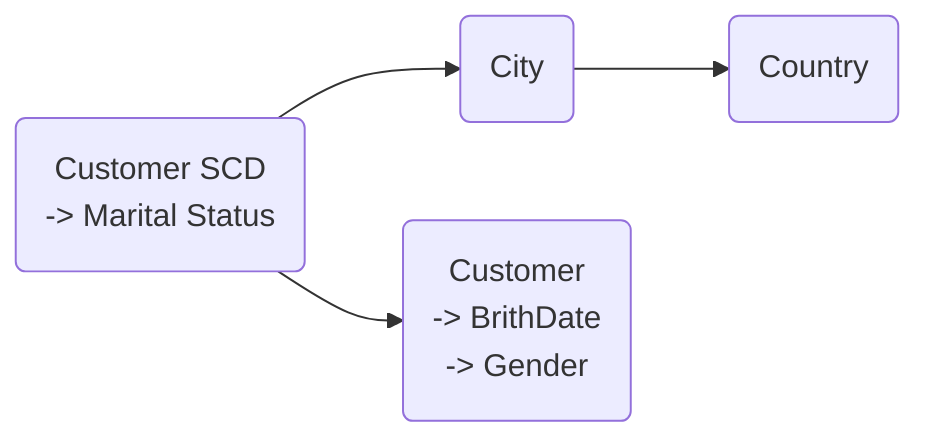

# Bonyolultabb dimenziók
## Csoportosítás (Grouping)
A dimenziókon belül viszonylag ritka, hogy csoportosítást kell alkalmazni, mivel nem szokott olyan sok eleme lenni egy dimenziónak, hogy a böngészésnél gondot okozzon. Ha mégis szükség lenne rá, akkor vannak az dimenziószerkesztőben beépített algoritumosok, amik pl. megpróbálnak azonos elemszámú csoportokat képezni. Ez azonban ritkán vezet használható eredményre, ezért érdemesebb inkább az adatbázisban, egy view-ban új, dimenziómezőt létrehozni `CASE ... WHEN` paranccsal, és arra egy új dimenziót építeni.
## Cimkézés (Banding)
Amikor értékekeket akarunk halmazokba csorolni (alacsony-közepes-magas) akkor arra is új mezőt és dimenziót érdemes létrehozni, viszont előfordulhat, hogy az egyes cimkék kategorizálása változhat idővel. Ezért hogy ne kelljen folyamatosan újraszámoltatni az egész adatsort, érdemes a dimezniónak olyan kulcsot adni, ami a besorolás mögöttes értékéhez kapcsolódik. Így a dimenzióban megoldhatjuk a kategóriák megváltozását, és nem kell az egész ETL eljárást újrafuttatni.
## Lassan Váldozó Dimenziók (Slowly Changing Dimensions - SCD)
### I. Típus
Mivel ennél a típusnál a dimenziótáblában a régiértékek felülíródnak az újakkal, ezért ennek a típusnak a használata nem igényel külön odafigyelést a DB tervezése során.
Hibába akkor ütközhetünk az attribútum-hierarchiában egyes kapcsolatok `rigid`-re lettek állítva, és az attribútum helye megváltozott a többi attribútumhoz képest. Vagy ha az attribútum-hierarchiában definiált kapcsolatok megváltoztak.
Amire még oda kell figyelni, hogy azok a mértékek, amik dimenziók mentén épülnek fel, azok is invalidálódhatnak. A dimenziók tulajdonságai között be lehet állítani a `MDXMissingMemberMode`-ben, hogy erre hogyan reagáljon. Az alapértelmezett érték az `Ignore`, így figylemeztetés nélkül széteshetnek jelentéseink. Ha azonban `Error`-ra állítjuk be akkor az AS hibával fog leállni, és manuálisan kell kijavítani a hibát, vagy akár törölni a riportot, és elölről kezdeni a programozását.
### II. Típus
Mivel az Analysis Services OLAP szerver nem tárolja a dimenziók verzióit, ezért a TypeII változtatásoknál a dimenziótáblához új sor adódik hozzá. Abban az esetben, ha csak további adatokat adunk hozzá egy dimenzióhoz, és nem módosítunk meglévő adatokat, elegenedő `Process Add`-t futtatni `Process Update` helyett, ami sokkal gyorsabb feldolgozást jelent.
#### Attribútumkapcsolatok modellezése
Az SCDII típusú dimenziótbákban kétfajta kulcsnak kell lennie. Egy üzleti kulcsnak (ami akár összetett kulcs is lehet), illetve egy surrogate kulcsnak, ami magát a táblát is kulcsolja. Ebből a táblából ezért *két* dimenziót lehet építeni. Az egyik az üzleti kulcsot fogja kulcsként használni, a másik pedig a surrogate kulcsot. Az első mindig a legfrissebb adatok alapján fogja besorolni a dimenzióelemekhez tartozó adatokat, az utóbbi pedig a töltéskori állapot alapján sorlja be újra a tényadatokat.
A példában a **Customer** dimenziót vesszük alapul és megépítjük belőle a *Customer SCD* és a *Customer* attribútumokat. Azok az adatok, amiket nyomon akarunk követni, azoknak az Attribútom kapcsolatokban a *Customer SCD*-hez kell kapcsolni, míg az állandónak szánt adatokat a *Customer*hez. Így biztosítva lehet, hogy egyik ágon se forduljon elő adott vevő kétszer.
Ha azonban olyan tulajdonsága változik meg a vevőnek, amire nem számítottunk a modellezés során, akkor SCD-ben új sor keletkezik, és az SCD hierarchia mentén történő lefúrásnál adatduplikációval találkozhatunk. Ezt úgy küszöbölhetjük ki, hogy a kapcsolatokba beépítünk egy újabb szintet, ami kapcsolótáblaként szolgál, mint egy több-több kapcsolat esetén.
#### Státuszok kezelése
Az SCD dimenziók három mezőt tartalmaznak, amik az adott rekord érvényességére vonatkoznak:
- egy mező, annak eldöntésére, hogy az adott rekord aktuális-e
- egy mező az érvényesség kezdetére
- és egy mező az érvényesség végre, amik azt tartalmazzák, hogy az adott rekord mettől meddig volt aktuális.

Ezeknek a mezőknek nem feltétlenül szükséges a dimenzióban is szerepelni, de vannak esetek, amikor hasznosak lehetnek.
Az `aktuális` attribútumból dimenziót építeni annyiból áll, hogy `true/false` értéket társítunk hozzá. Ezt azonban érdemes elrejteni a kockában, mert ha bekerül egy lekérdezésbe, akkor ott csak azok a tényadatok kerülnének be az aggregációba, amik az dimenzió aktuális állapotához tartoznak.
### III. Típus
Az a változáskövetés két mezőt használ: az egyikben az aktuális értéket tárolja, a másikban pedig az előzőt. Ezt a típust elég riták használják valós problémák kezelésére mivel elég korlátozottak az előnyei.
## Junk dimensions
Azokat az egyszerűbb dimenziókat, amik ritkán változnak, és nem rendezhetők attribútum hierachiákba, azokat érdemes egyetlen dimenziótáblába rendezni, hogy ezután könnyebben karbantartható legyen.
## Ragged hierarchies
Előfordulnak olyan hierarchiáka-fák, amik nem kiegyensúlyozottak, tehát az egyes ágai más-más mélységűek lehetnek.
Ennek a problémának a kezelésére használható `Parent/child` hierarhcia is, ami varázslóból érhető el. Ehhez arra van szükség, hogy az alap dimenziótáblában a hiearchia minden pontja szerepeljen a kulcs mezóben, és a rekord egy másik mezőjében szerepelni kell az adott ponthoz tartozó szülőpont ID-ja is, majd a *Data Source View*ban kell beállítani, hogy a tábla saját magára hivatkozzon vissza. Ez után Dimenzióvarázslóval megépíthető az adott hierarchia. Ennak a megoldásnak azonban megvannak a hátrányai:
 - dimenziónként csak egy Parent/child hierarchia építhető
 - ilyen hierarchia csak kulcs attribútumokból építhető
 - néhéz vele MDX lekérdezésekben dolgozni
 - a dimenzió processzálása lassabb, és nagyobb dimenziók esetében kifejezetten rosszul skálázódik

**Általában nem ajánlott a használata, csak ha végképp elkerülhetetlen!**

A problémát a dimenzióattribútumok `HideMemberIf` tulajdonságainak beállításával is meg lehet oldani. Ehhez arra van szükség, hogy a dimezió alapját adó táblában kiterítsük a hierarchia szintjeit, a köztes (nem minden ágra jellemző) szinteket pedig vagy a szülő, vagy az egyetlen gyerek ID-jével kell kitölteni. Ezután a hierarchia szintjeire kell beállítani, `HideMemberIf: OnlyChildWithParentName`. Hogy ez a kliens eszközöben is megfelelően jelenje meg, a connections stringben az `MDX Compatibility = 2` tulajdonságot kell beállítani. *(Ez Excel 2007-ben még nem működik, csak attól fölfelé.)*
