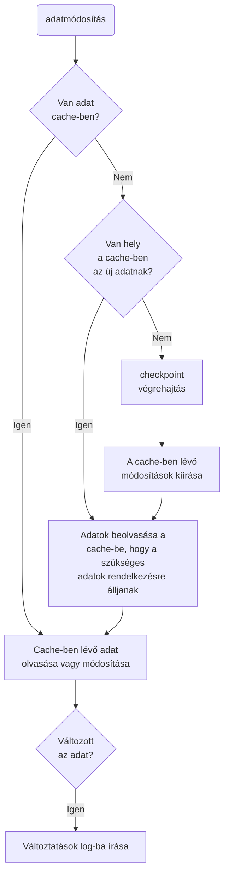

#Tranzakciók
A Tranzakciók lényege az automatizálás. Az automatizmus egy egységként viselkedik a nagyobb programon belül. Olyan több parancsból álló kódblokk, amiből vagy minden végrehajtódik, vagy semmi.

**ACID teszt:**
- Atomicity: A tranzakció vagy lefut, vagy nem.
- Consistency: Minden kötelem és adatintegrációs szabály érvényben marad.
- Isolation: Minden tranzakció teljesen különálló a többitől, és nincsenek hatással egymásra.
- Durability: Amint egy tranzakció befejeződik, a hatásai visszavonhatatlanul a rendszerben maradnak. Az adatok annyiban biztonságosak, hogy rendszerszintű hibákat kivéve, nem kerülnek a rendszerbe csak félig megváltozott adatok.

Implicit módón minden egyes SQL utasítás maga is egy tranzakció
Minden más esetben magunknak kell kijelölni az egyes tarnzackiók elejét, végét, és definiálni a futás sikerességét, illetve kudarcát:
* **BEGIN**: a kezdőpont beállítása
* **COMMIT**: a tranzakció véglegesítése, ami beleír az adatbázisba
* **ROLLBACK**: visszaállás a tranzakció előtti állapotra
* **SAVE**: mentési pont beállítása, hogy részleges `ROLLBACK` is végrehajtható legyen.

##BEGIN TRAN
Ez jelöli a tranzakció kezdetét.
```sql
BEGIN TRAN[SACTION] [<transaction name>|<@transaction variable>]
	[WITH MARK [ <'descreption'> ]]
```
##COMMIT TRAN
A `commit` egy lezárt tranzakció végét jelzi. Ekkor hajtódnak végre a tranzakcióban felírt utasítások. Az utasításokat itt már nem lehet visszavonni, csak törekedni lehet az eredeti állapot helyreállítására.
```sql
COMMIT TRAN[SACTION] [<transaction name>|<@transaction variable>]
```
##ROLLBACK TRAN
A `ROLLBACK` visszavon minden SQL utasítást, ami a `BEGIN`, vagy egy *mentési pont* óta történt. Az kiadott utasításokról az adatbázis nem fog tudomást venni.
```SQL
ROLLBACK TRAN[SACTION] [<transaciton name>|<save point name>|<@transaction variable>|<@savepoint variable>]
```
##SAVE TRAN
Ahhoz, hogy a tranzakcióból ne minden vesszen el egy `ROLLBACK` folyamán (pl: log bejegyzések), lehetőség van mentési pont(ok) kijelölésére, amik mint könyvjelzőkként működnek a script futásakor. Ezért minden mentési pontnak külön nevet kell adni.
```sql
SAVE TRAN[SACTION] [<save point name>|<@savepoint variable>]
```
A mentési pontok a `ROLLBACK` végrehajtásával mind törlésre kerülnek, azaz csak a tranzakció scope-jában értelmezettek.
##Hogyan működik az SQL Server LOG
Az adatbázis nem csak ritkán egyezik meg a közvetlenül a lemezre írt fájlban tárolt adatokkal. Általában az adatbázis csak a LOG-gal együtt teljesértékű, ami az utolsó checkpoint óta íródott bele.
Normál működés során az adatbázisműveletek felírodnak a tranzakcióslogba, és a checkpoint-okhoz érve az elvégzett változtatások kiíródnak a lemezre. Checkpoint nélkül a tranzakciós log betelhet, ami hibás működéshez, a működés megszakadásához vezethet.
Nem kell külön utasítást kiadni ahhoz, hogy az elvégzett műveletek a cache-ből véglegesen az adatbázisba íródjanak, mivel erről az SQL server gondoskodik. A `CHECKPOINT` műveletet azonban speciális esetekben is meg lehet hívni:
* manuálisan a `CHECKPOINT` paranccsal
* a szerver normál leállítása során (hacsak a `WITH NOWAIT` opciót nem használtuk)
* amikor az adatbázis beállításai megváltoznak (pl: single user only, dbo only, stb.)
* amikor a *Simple Recovery* beállítás aktív, és a log kihasználtsága 70%-on meghalad
* amikor a logban lévő adatmennyiség meghaladja a visszaállítható mennyiséget a beállított visszaállítási intervallum alatt.

**A log működését az alábbi ábra szemlélteti:**

##Kudarc(failure) és Visszaállás(recovery)
A visszaállítás az SQL szerver indításakor megtörténik automatikusan. A logban lévő utolsó checkpoint óta létrejött commit-ok beíródnak az adatbázisban, minden más pedig rollback-kel kiürül a logból.
A visszaállítás során azok tranzakciók, amik az utolsó checkpoint és a rendszerleállás között íródtak volna a lemezre a visszaállítás során fognak véglegesedni (rolling forward). Azok a tranzakciók, amik nem fejeződtek be a rendszerleállásig pedig el fognak veszni, újra meg kell hívni azokat.

##Implicit tranzakciók
Kompatibilitási okokmiatt alapértelmezetten ki van kapcsolva, de be lehet állítani, hogy végrehajtás során, hogy `BEGIN TRAN` parancs nélkül is tranzakció kezdődik az első utasítással, ami a `COMMIT TRAN` vagy a `ROLLBACK TRAN` utasításig tart, és utána egy újabb tranzakció kezdődik automatikusan.

#Locks and Concurrency
A *Concurrency* azt kezeli, hogyan használhatják egyszerre többen is ugyanazt az adatbázis objektumot. Hogy az egymással párhuzamosan futó tranzakciókat kezelje, az adatbázis lock-kokat használ. A Lock-ok akadályozzák meg, hogy az adatbázisobjektumokkal egymásnak ellentmondó műveletek történjenek.

++**Problémák, amik megakadályozására a lock-ok létrejönnek:**++
- *Dirty reads (helytelen olvasások)*
Azt az esetet akadályozza meg, hogy egy tranzakicó olyan adatot olvasson ki, amin egy másik tranzakció futása még nem fejeződött be. Ha a tranzakciók hiba nélkül lefutnak, akkor nem lenne gond az adatokkal, de ha a tranzakció rollback-kel ér véget, akkor a másik tranzakció alatt elmozoghatnak az adatok.
- *Non-repeatabel reads (nem megismételhető olvasások)*
Akkor fordul elő, amikor egy tanzakció kétszer olvasna be egy olyan adatot, amit egy másik tranzakció az első futása közben megváltoztat. Például egy feltételes művelet során, amikor az a adott értéket annak érétéke alapján változtatná meg. A hibát kétféleképpen lehet kiküszöbölni: *1.)* vagy beépítünk egy ellenőrzést az 547-es hibára, vagy *2.)* az izolációs szintet `REPEATABLE READ`-re, vagy  `SERIALIZABLE`-re kell állítani.
- *Phantoms (fantomok)*
Olyan rekordok megjelenése, amikre ránézésre nincs hatással az `UPDATE` vagy a `DELETE` parancs. Ritkán fordul elő, de a megfelellő körülmények között megeshet. Például, ha egy UPDATE utasítás ugyanakkor fut le, mint egy másik felhasználó INSERT-je. Ekkor előfurdulhat, hogy az UPDATE nem terjed ki az új rekordokra, így az UPDATE nem azt eredményezi, mint amire számítunk. Ezt az esetet egyedül úgy lehet kivédeni, ha az izolációs szintet `SERIALIZEABLE`-re állítjuk, minden olyan más tranzakciót kilockol, ami a tranzakció WHERE klauzulájába esik.
- *Lost updates (elvezett adatfrissítések)*
Lost Update akkor történik, ha egy update sikeresen lefut, de véletlenül egyből felül is íródik egy másik Update utasítással. Például ha ketten egyszerre akarják ugyanannak a rekordnak két mezőjét módosítani. Ekkor az első elvész, és csak a második hajtódik ténylegesen végre.
##Zárolható objektumok
Hat adatbázisobjektum van, amihez LOCK rendelhető, és ezek hierachiát is jelentenek. A magasabb hierarchiaponton lévő Lock-ok zárolják az alsóbbrendőeket is:
**1. Database**: Az egész adatbázis zárolásra kerül ilyenkor. Általában sémaváltoztatásokkor kerül rá sor.
**2. Table**: A tábla zárolása vonatkozik annak minden egyes adatsorára, kulcsára és az indexekre.
**3. Extent**: A extentre helyezett zárolás annak minden lapjára, és az azokban található adatokra és indexekre is kiterjedt.
**4. Page**: Az oldalon lévő adatok és indexek is zárolásra kerülnek.
**5. Key**: A záron belül egy, vagy egy sor kulcsot is meg lehet jölni, de ettől az idexben található többi kulcs még módosítható maradhat.
**6. Row, Row Identifier (RID)**: Csak egy adatsort zárol, de azt teljesen.

##Zárak kijelölése, és hatása a teljesítményre
A zárak kijelölésénél azt kell figylemebe venni, hgoy milyen pontosságal akarjuk a zárakat alkalmazni. Minél több zárat alkalmazunk, azokat annál nehezebb karbantartani a rendszernek, és így sok erőforrást vehet el a lényegi funkciók végrehajtásától. Ha a zárak száma elér egy bizonyos mértéket egy adott szinten, akkor az adatbázis a zárat automatikusan egy szinttel feljebb lépteti, és így egyszerűsíti a munkáját.
###Zárolási módok
A lock szintje mellett annak módját is meg lehet választani. A mód kiválasztásánál figyelembe kell venni, hogy egyes módok csak magukban használhatók, míg mások csak arra szolgálnak, hogy módosítsanak velük más módokat.
* **Shared Locks**: Ez a legalapvetőbb típus. A shared lockot akkor használja az adatbázis, ha csak olvasni akarunk valamilyen adatot. Ez minden más lock típussal kompatibilis, de van olyan lock, ami még ezt sem tűri meg. A shared lock lényegében annyit mond, hogy valaki használja az adatot, és közben megakadályozza a *Dirty read*eket.
* **Exclusive Locks**: Ahogy a neve is sugallja ez a zár nem kompatibilis egyetlen másik zárral sem. Addig nem lehet alkalamazni, amíg másik zár van érvényben, és amíg érvényben van új zár nem jön létre. Ez akadályozza meg, hogy két felhasználó egyszerre frissítsen vagy töröljön.
* **Update Locks**: Ez egy hibrid a shared és az excluse lock között. Egy update során az adatbázis először felméri a where klauzula alapján, hogy mely rekordokat kell update-elni, és ekkor még csak shared lock van az objektumon. Amikor pedig ténylegesen adatmódsításra kerül sor, akkor amint lehetséges a lock exclusive módra vált, amíg megtörténik az írás. Ha az Update nem ír adatot, akkor a lock shared marad. Ebben az a jó, hogy ameddig csak olvasási műveleteket hajt végre a rendszer, addig nem zár el másokat az erőforrástól. Amíg az update lock aktív, addig csak újabb shared és intent shared lockok jöhetnek létre.
* **Intent Locks**: Ez a zár hivatott kezelni az objektumok közötti hierarchia problémáját. Azt akadályozza meg, hogy egy magasabb szintű objektumon végzett művelet felülírja az alacsonyabb szintű objekumon alkalmazott zárat. Enélkül a magasabb szintű objektum nem tudná, hogy valamelyik hozzá tartozó objektumon éppen dologznak. Az intent locknak három fajtája van:
 * Intent shared lock: egy share lock van éppen folyamatban, vagy készül megvalósulni egy tábla, vagy page alacsonyabb szintű objektumán.
 * Intent exclusive lock: akkor használja az adatbázis, ha exclusive lock készül rákerülni, vagy van folyamatban egy tábla vagy oldal alacsonyabb szintű objektumán.
 * Shared with intent exclusive lock: egy shared lock készül rákerülni egy alacsonyabb szintű objektumra, de a zárolás szándéka adatmódosítás, ezért egy idő után exclusive-vá fog válni a lock. 
* **Schema Locks**: két változata van 1.) Shema modification lock, amikor az objektum schemája változik meg, és ilyenkor semmilyen lekérdezést, Create, Alter, Drop utasítást nem lehet lefuttatni a zár ideje alatt, 2.) Schema stability lock akkor keletkezik, ha bármilyen más zár is életben van. Az egyetlen feladata, hogy megakadályozza a Schema modification lockot, amikor még műveleteket hajtanak végre az adatbázison.
* **Bulk Update Locks**: lényegében ugyanaz, mint a táblák zárolása azzal a különbséggel, hogy engedi a párhuzamos adatbetöltést (BULK INSERT) is.
##Optimalizáció
Az ú.n. `optimizer hint`-ek segítségével manuálisan is szabályozni lehet a lekérdezések, vagy a tranzakciók zárolási mechanizmusait.
>Majd a professional könyvben.

##Zárak felismerése a Management Studio Segítségével
A Management Studio vagy processID alapján vagy objektum alapján tudja megmondani a zárakat az Activity Monitor segítségével.
##Izolációs szint beállítása
A lock-ok beállítása számos problémát előz meg, miközben szabályozza az erőforrásokhoz való hozzáférést. Amit fontos megérteni, hogy a tranzakciók, és a lock-ok együtt járnak. Ha egy adatmódosító tranzakció sokáig tart, akkor alapértelmezett beállítások melett a futása idejére blokkolhatja a hozzáférést az adatbázis erőforrásaihoz.
Manuálisan azonban 5 különböző izlációs szintet lehet beállítani az alábbi paranccsal:
````sql
SET TRANSACTION ISOLATION LEVEL <READ COMMITTED|READ UNCOMMITTED|REPEATABLE READ|SERIALIZABLE|SNAPSHOT>
```
###READ COMMITED (default)
Ez az alapértelmezett lock. Egy `SELECT` parancs futtatásakor a shared lock keletkezik, ami a parancs végén feloldódik. Adatmódosító utasításoknál az egész tranzakció ideje alatt fennmaradnak a lock-ok arra az esetre, ha `ROLLBACK`-et kellene végrehajtani. Az alapértelmezett beállításokkal a *dirty read*ek megelőzhetőek, de *non-repeatable read*-ek és *phantom*ok még előfordulhatnak.
###READ UNCOMMITTED
Ez a legveszélyesebb izolációs szint, de ugyanakkor ez biztosítja a legnagyobb teljesítményt. Ezzel az utasítással az SQL szerver nem indukál lock-okat és nem is veszi figyelembe más tranzakciók lock-jait, így semmilyen konkurens műveletet sem fogunk érzékelni a parancs futtatásakor, így *dirty read*ek is előfordulhatnak.
Tipikus előfordulása riportálásnál van, amikor az élő adatbázisból történő folyamatos és sorozatos olvasás akadályozhatja az adatrögzítők munkáját. A gyors, és nem pontos számokat eredményezhet ez az eset, ezért mindenképpen küröltekintően kell használni.
Ezzel egyenértékű az alakalmi `(nolock)` megjegyzés az egyes lekérdezésekben, ami csak a lekérdezés tartamára vonatkozik, és a futás végén visszaáll az alapértelmezett izolációs szintre a szerver.
###REPEATABLE READ
Ez a lock kiterjeszti az alapértelmezett zárolásokat, és így már nem csak a `dirty read`ek ellen jelent védelmet, hanem megelőzhetőek vele a `non-repeatable read`ek is. Ez ugyanakkor azt is jelenti, hogy az egész taranzakció során fennmaradnak a shared lock-ok, így tranzakció időtartamára a kapcsolódó erőforrásokból ki lesznek zárva a felhasználók. Ennek pedig kihatása lehet a teljesítményre is.
###SERIALIZABLE
Ez az egyik legerősebb védelem az ütközések kezelésére. Megelőzi a `phantom`okat is, és így csak a `lost update`ekre kell odafigyelni. Ez a lock lényegében az egész tranzackó alatt fenntartja a lockokat a WHERE és a FROM kaluzulákban hivatkozott táblákra és objektumokra, a tranzackió teljes befejezéséig. Ha egy másik felhasználó is használni szeretné a hivatkozott objektumokat, akkor várnia kell, ami a zárat kiadó tranzakció be nem fejeződik. Ez az izolációs szint a `(HOLDLOCK)` optimalizációs kapcsolóval is indítható. Ezzel az izolációs szinttel azt lehet elérni, hogy egyszerre csak egy felhasználó futtathasson tranzakciókat.
###SNAPSHOT
Ez a legújabb izolációs szint, ami az SQL Server 2005-ben jelent meg először. Alapesetben nem is érthető el: adatbázis szinten kell aktiválni a `ALLOW_SNAPSHOT_ISOLATION` paranccsal. Maga a lok a `READ COMMITTED` és a `READ UNCOMMITTED` egyfajta kombinációja. Ez a mód nem hoz létre, és nem is vesz figyelembe más zárakat. Viszont figyeli, hogy más lock-ok mikor aktiválódtak az objektumokon, így a lekérdezés azt az eredményt adja vissza, amit a lekérdezés megkezdésekori állapot alapján visszaadott volna, és a közben bekövetkezett változásokat figyelmen kívül hagyja.
##Deadlocks
A Deadlock egy paradoxon az objektumok zárolása körül, ami az 1205-ös hibaszámon is ismert. Akkor fordul elő, amikor az egyik lock nem tud feloldódni, mert egy másik lock foglalja ugyanazt az erőforrást. Az egyik utasításnak nyernie kell, így a szerver kiválaszt egy *áldozatot - deadlock victim* - és az 1205-ös hibával tér vissza, a másik tranzakció viszont nem is szerez tudomást a konfliktusról, csak a futási idő válik szokatlanul hosszúvá.
Az SQL szerver minden öt másodpercben ellenőrzi, hogy milyen tranzakciók futnak jelenleg, és hogy milyen lockokra várnak a futás folytatásához. És megvizsgálja, hogy melyik tranzakció melyikre vár, hogy feloldja a zárakat. Ezt rekurzívan teszi, így láncokat épít az egymásra váró tranzakciókból, és ha körkörös hivatkozást talál, akkor áldozatot választ. Alapértelmezetten az lesz az áldozat, emelyiknek a `ROLLBACK`-je kevesebb erőforrást igényel.
###A Deadlock-ok megelőzése:###
Komplex rendszerekben a deadlock-ok nem küszöbölhetőek ki teljes bizonyossággal, de az előfurdulásuk valószínűsége jelentősen csökkenthető a következő szabályokkal.
1. Használjuk az objektumokat mindig azonos sorrendben
2. Legyenek a tranzakciók a lehető legrövidebbek
3. Tartsuk az izolációs szintet a lehető legalacsonyabban
4. Ne engedjük a nyitott megszakításokat tranzakción belül
5. Szabályozott környezetben használjunk bound kapcsolatot

